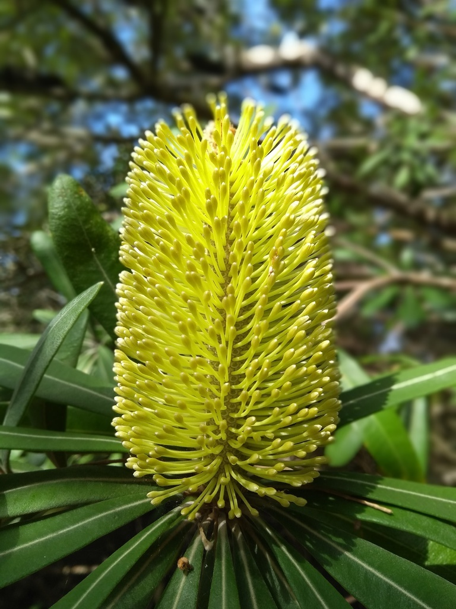

## Drupal 10 and beyond

---

### About me

@larowlan

Note:

- Drupal development for 13 years
- PHP Development for 20
- Core committer, Security team you're probably using one of my modules

---

### ️Overview

<ul>
<li class="fragment fade-in-then-semi-out">Where are we?</li>
<li class="fragment fade-in-then-semi-out">Where are we going?</li>
<li class="fragment fade-in">Where do we need to go?</li>
</ul>

Note:

- One of my typical navel gazing exercises

---

### Chapter 1: Where are we?

---

### Drupal 10 will come out next year

---

### Three scenarios

<ul>
<li class="fragment fade-in-then-semi-out"><strong>Planned: June 15 2022</strong></li>
<li class="fragment fade-in-then-semi-out">Fallback: August 17 2022</li>
<li class="fragment fade-in">Break-glass: December 14 2022</li>
</ul>

---

### Drupal 9

Drupal 9.3 is due December 8

*Please help us test the pre-releases

---

### Drupal 9.4

<ul>
<li class="fragment fade-in-then-semi-out">Drupal 9.4 will co-incide with Drupal 10.0*</li>
<li class="fragment fade-in">Drupal 10.0 with deprecated code</li>
</ul>

*All things going to plan

---

### Drupal 8

Note: 

- Drupal 8 came out in 2015 and is nearly 6 years old
- iphone 6
- star wars episode 8 was in cinemas

---

<!-- .slide: data-transition="fade" -->

### 🪦 Drupal 8 is EOL

---

<!-- .slide: data-transition="fade" -->

### 🪦 Drupal 8 is End Of Life

---

<!-- .slide: data-transition="fade" -->

### 🪦 Drupal 8 will have no more security updates*

*All things going to plan

Note:

- So if you're still on Drupal 8, your job next week is to move to Drupal 9

---

### 🧚 Updating to Drupal 9 is much easier

https://pnx.me/3C6v3kH

Note:

- Provided you're on Drupal 8

---

### But I'm on Drupal 7!

Note:

- Drupal 7 came out in 2011
- You were rocking an iphone 4
- thunderbolt displays just came out
- Game of Thrones season 1 was just out
- 2 years before Brooklyn 99
- the last harry potter movie was in cinemas

---

### Drupal 7 is older than Doge

Note:

- Drupal 7 is the Windows XP of Drupal
- And I don't mean that its the only thing your grandparents and banks can agree on

---

### Drupal 7

<ul>
<li>Is end of life in Nov 2022</li>
<li class="fragment fade-in-then-semi-out">There will be an Extended support option</li>
</ul>

Note:

- Extended support will likely require either a paid subscription or self serve

---

### Is 2 years too soon?

---

### Examine previous releases

---

---

### Chapter 2: Where are we going?

---

### Examine driving factors (php, symfony, ckeditor)

---

### What's coming in Drupal 10?

---

### Drupal 10.0 will be boring

9.4 minus deprecations
We're building Drupal 10 in Drupal 9
Easier again to upgrade (Charts from gabor)

---

### What about in Drupal 10.x?

- talk about initiatives

---

### New frontend theme

---

### Decoupled menus

---

### Project browser

Why is this important? Global training day

---

### Easy out of the box

---

### Automatic updates

---

### Starter kit theme

---

### User facing dependencies

ckeditor 5

---

### Lower level plumbing

php, symfony, composer, db versions

---

### 2 year cycles become the norm

link to issue, talk about reasons

---

### Remove jquery /jquery ui /backbone

---

### Chapter 3: Where do we need to go?

---

### Contributions are down

Covid is a factor, but no new faces are also an issue
Barrier to entry is higher, as a user and a contributor
We need to be bringing in fresh faces
Global talent shortages
Many of these initiatives point to that
But the reality is, the web landscape has changed
Monolith CMSs are less attractive
Decoupled menus sets us up for the future
Talk about NPM packages
Javascript is eating the Web
Atwood's law
JSON:API is a start but there are many places where API is second class citizen to theme/form apis

---

### Credits

- https://flickr.com/photos/tgerus/3807995646
- http://slides.com/gaborhojtsy/state-of-drupal-10-readiness-sept-2021
